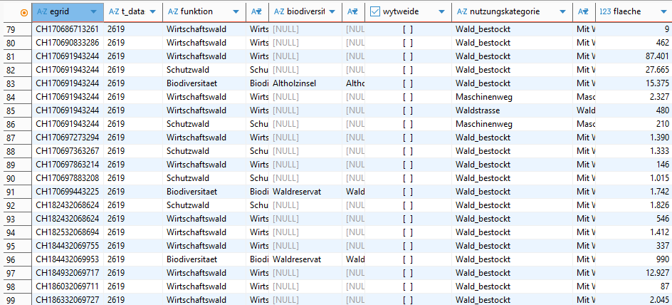

# Beschreibung GRETL-Job awjf_waldplan_pub
Dieses Readme gibt zusätzliche Informationen zum GRETL-Job awjf_waldplan_pub. Es ist komplementär zu den Kommentaren in den SQL-Files und build.gradle-File.

## Ziel GRETL-Job
Publikation der Waldplan-Daten aus dem Edit-Schema awjf_waldplan_v* im Pub-Schema awjf_waldplan_pub_v*.

## Struktur GRETL-Job
Da viele Flächen miteinander verschnitten werden und Zwischentabellen bei der Berechnungen helfen, wird die Processing-DB genutzt. <br>
Die Publikations erfolgt gemeindeweise gemäss der BFS-Nr. Die BFS-Nr. entspricht auch immer dem Dataset.

Der Gretl-Job ist folgendermassen aufgebaut:
```
┌──────────────────────────────────────┐
│ Erstellung Tabellen in Processing DB │
└──────────────────────────────────────┘
                    │         
                    ▼
┌──────────────────────────────────────┐
│ Import Daten in Processing DB        │
└──────────────────────────────────────┘
                    │         
                    ▼
┌──────────────────────────────────────┐
│ Flächenberechnungen in Processing DB │
└──────────────────────────────────────┘
                    │         
                    ▼
┌──────────────────────────────────────┐
│ Export XTF aus Processing DB         │
│ nach BFS-Nr                          │
└──────────────────────────────────────┘
                    │         
                    ▼
┌──────────────────────────────────────┐
│ Ersatz Daten auf Pub DB mittels      │
│ exportiertem XTF-File                │
└──────────────────────────────────────┘
                    │         
                    ▼
┌──────────────────────────────────────┐
│ Update Anzeigenamen auf Pub DB       │
└──────────────────────────────────────┘
                    │         
                    ▼
┌──────────────────────────────────────┐
│ Publisher                            │
└──────────────────────────────────────┘
```

Anmerkung: Bei der Waldübersicht handelt es sich um ein Multipolygon über die ganze Gemeinde. Daher wird diese immer komplett neu publiziert.

### Publikation alle Gemeinden
Wenn statt der BFS-Nr. "alle_gemeinden" eingegeben wird, können alle Gemeinden publiziert werden.
Damit dies funktioniert wurde in den Gretljob ein Loop mit allen relevanten Tasks eingbaut. Diesem Loop wird zu Beginn eine Gemeindeliste übergeben. Wenn nur eine Gemeinde publiziert werden soll, enthält die Liste nur die angegebene BFS-Nr. Wenn "alle_gemeinden" als Variable übergeben wird, greift die Liste auf eine vordefinierte Liste mit allen Gemeinde-BFS-Nr. zu.

Im Normalfall sollte dies nur gemacht werden, wenn das Schema neu aufgesetzt wird und initial alle Gemeinden publiziert werden sollen.

## Flächenberechnungen
Innerhalb des Gretl-Jobs werden diverse Waldflächen berechnet. Als Basis für die Flächenberechnung wird im Task `processingPubData` mit dem SQL `06_awjf_waldplan_grundstueck_03_waldfunktion_waldnutzung_processing.sql` eine Tabelle gebildet, die sich aus den verschnittenen Waldfunktions- und Waldnutzungskategorie pro Grundstück zusammenstellt. Der nachfolgende Screenshot zeigt einen Ausschnitt der Tabelle aus der Processing-DB:



Daraus können dann sämtlich benötigte Flächenwerte aus der Kombination aus Waldfunktion und Waldnutzung abgeleitet werden.

Wichtig dabei sind vor allem die prodiktiven (resp. unproduktiven) und hiebsatzrelevanten (resp. nicht hiebsatzrelevanten) Waldflächen.
Diese setzen sich folgendermassen zusammen

* <b>Prodkutive Waldfläche:</b> Nutzungskategorie IN ('Wald_bestockt', 'Nachteilige_Nutzung')
* <b>Unproduktive Waldfläche:</b> Nutzungskategorie IN ('Wald_bestockt', 'Nachteilige_Nutzung')
* <b>Hiebsatzrelevante Waldfläche:</b> Produktive Waldfläche - (Funktion = 'Biodiversitaet' AND biodiversitaet_objekt IN ('Waldreservat', 'Altholzinsel'))
* <b>Nicht hiebsatzrelevante Waldfläche:</b> Unproduktive Waldfläche + (Funktion = 'Biodiversitaet' AND biodiversitaet_objekt IN ('Waldreservat', 'Altholzinsel'))
					